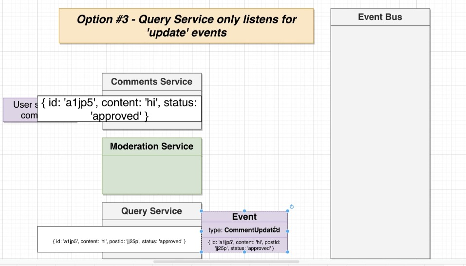
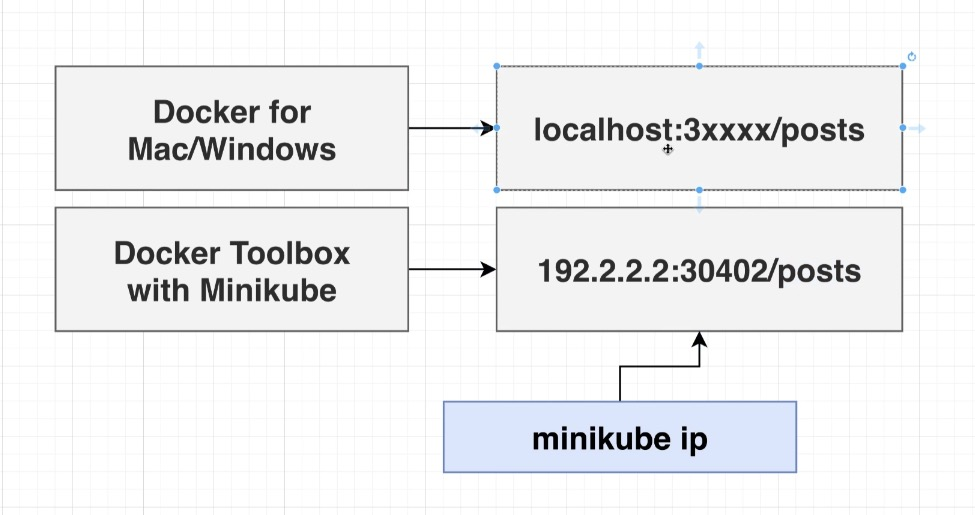

# Post Service
```javascript
const express = require('express');
const bodyParser = require('body-parser');
const { randomBytes } = require('crypto');
const cors = require('cors');
const axios = require('axios');

const app = express();
app.use(bodyParser.json());
app.use(cors());

const posts = {};

app.get('/posts', (req, res) => {
  res.send(posts);
});

app.post('/posts/create', async (req, res) => {
  const id = randomBytes(4).toString('hex');
  const { title } = req.body;

  posts[id] = {
    id,
    title
  };

  await axios.post('http://event-bus-srv:4005/events', {
    type: 'PostCreated',
    data: {
      id,
      title
    }
  });

  res.status(201).send(posts[id]);
});

app.post('/events', (req, res) => {
  console.log('Received Event', req.body.type);

  res.send({});
});

app.listen(4000, () => {
  console.log('Listening on 4000');
});


```
# PostList - React Component

```javascript

import React, { useState, useEffect } from 'react';
import axios from 'axios';
import CommentCreate from './CommentCreate';
import CommentList from './CommentList';

export default () => {
  const [posts, setPosts] = useState({});

  const fetchPosts = async () => {
    const res = await axios.get('http://posts.com/posts');

    setPosts(res.data);
  };

  useEffect(() => {
    fetchPosts();
  }, []);

  const renderedPosts = Object.values(posts).map(post => {
    return (
      <div
        className="card"
        style={{ width: '30%', marginBottom: '20px' }}
        key={post.id}
      >
        <div className="card-body">
          <h3>{post.title}</h3>
          <CommentList comments={post.comments} />
          <CommentCreate postId={post.id} />
        </div>
      </div>
    );
  });

  return (
    <div className="d-flex flex-row flex-wrap justify-content-between">
      {renderedPosts}
    </div>
  );
};


```