https://ticketing.dev/

`thisisunsafe`

# install ingress-nginx
```
 kubectl apply -f ingress-ngin-controller.yaml

 or 
 
 https://kubernetes.github.io/ingress-nginx/deploy/#docker-for-mac

```

http://ingress-nginx-controller.ingress-nginx.svc.cluster.local


```
sudo visudo

dayong-mac      ALL = (ALL) NOPASSWD: ALL
```

```
sudo vi /etc/hosts

127.0.0.1 ticketing.dev
```


# secret for jwt-secret
```
 kubectl create secret  generic jwt-secret --from-literal JWT_KEY=mykey123!
```

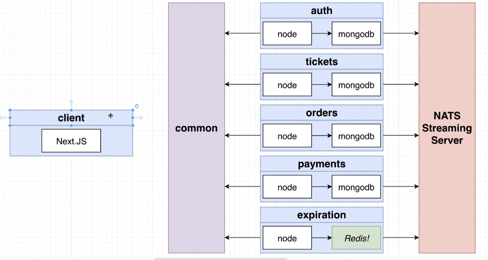
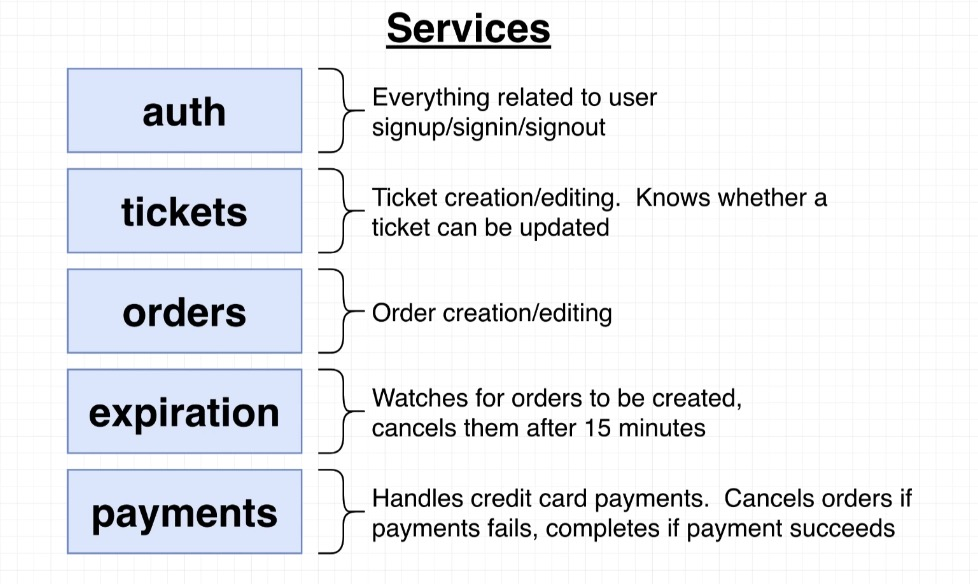
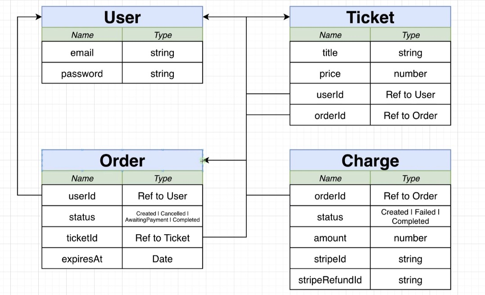
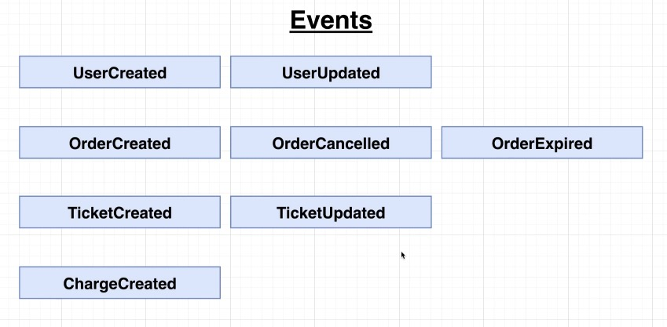

# Auth Service
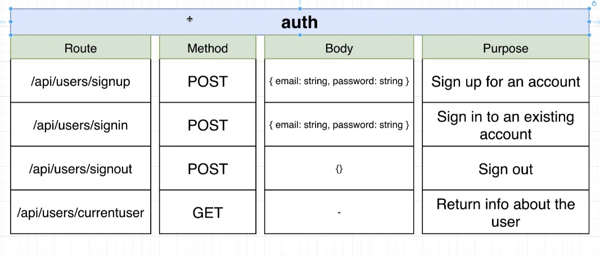
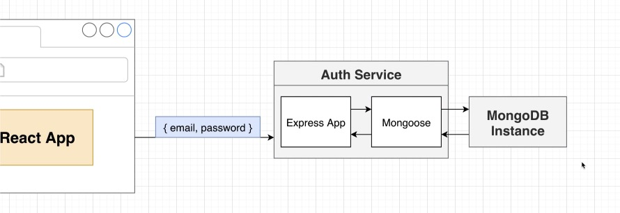
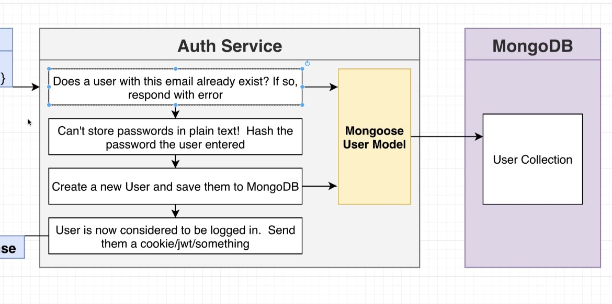

# Shared Lib

```
 Create an public Organizations: yltickets
 https://www.npmjs.com/settings/yltickets/packages
 
 npm login
 npm publish --access public
 
 // use common 
 npm install @yltickets/common
 // update common to new version
 npm update @yltickets/common
 
```
https://github.com/amliuyong/react-microservices/tree/main/02_ticketing/common

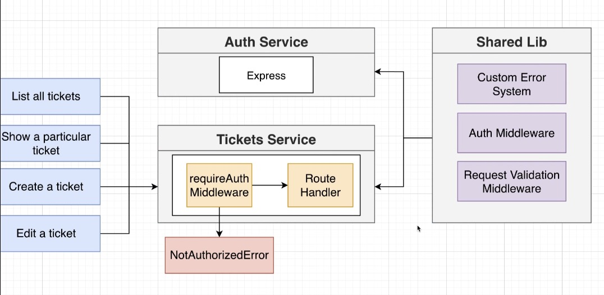

# Tickets Service
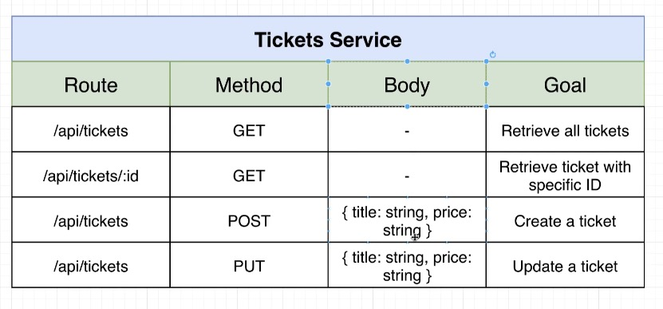
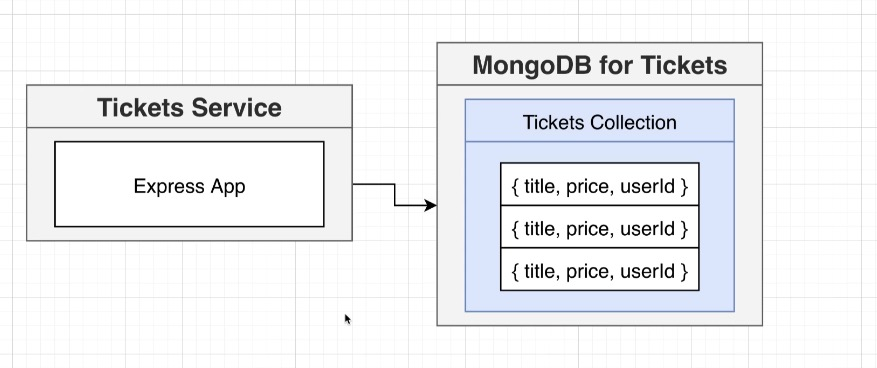

# Nats Streaming Server

`kubectl port-forward nats-depl-54fbfb678d-45z4q 4222:4222`

`kubectl port-forward nats-depl-54fbfb678d-45z4q 8222:8222`

http://127.0.0.1:8222/streaming

http://127.0.0.1:8222/streaming/channelsz?subs=1


https://github.com/amliuyong/react-microservices/tree/main/02_ticketing/nats-test/src

### Publish
```javascript
import nats from 'node-nats-streaming';

console.clear();

const stan = nats.connect('ticketing', 'abc', {
  url: 'http://localhost:4222',
});

stan.on('connect', () => {
  console.log('Publisher connected to NATS');

  const data = JSON.stringify({
    id: '123',
    title: 'concert',
    price: 20,
  });

  stan.publish('ticket:created', data, () => {
    console.log('Event published');
  });
});

```

### Listener

```javascript
import nats, {Message} from 'node-nats-streaming';
import {randomBytes} from 'crypto';

console.clear();

const clientId = randomBytes(8).toString('hex');
console.log(`clientId: ${clientId}`)
const stan = nats.connect('ticketing', clientId, {
    url: 'http://localhost:4222',
});

stan.on('connect', () => {
    console.log('Listener connected to NATS');

    stan.on('close', () => {
        console.log('NATS connection closed!');
        process.exit();
    });

    const options = stan
        .subscriptionOptions()
        .setManualAckMode(true)
        .setAckWait(20000)
        .setDeliverAllAvailable()
        .setDurableName('accounting-service');

    const subscription = stan.subscribe(
        'ticket:created',
        'queue-group-name',
        options
    );

    subscription.on('message', (msg: Message) => {
        const data = msg.getData();
        if (typeof data === 'string') {
            console.log(`Received event #${msg.getSequence()}, with data: ${data}`);
        }
        msg.ack();
    });
});

process.on('SIGINT', () => stan.close());
process.on('SIGTERM', () => stan.close());

```

# Events

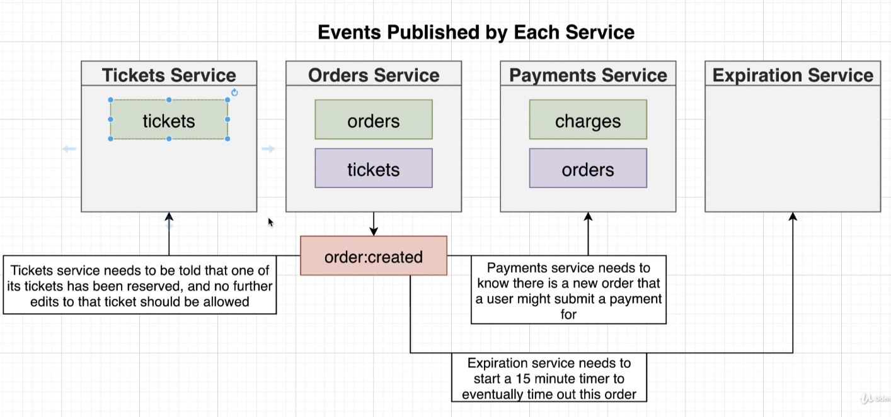

# How to handle disorder event

## Last event processed tracked by resource ID

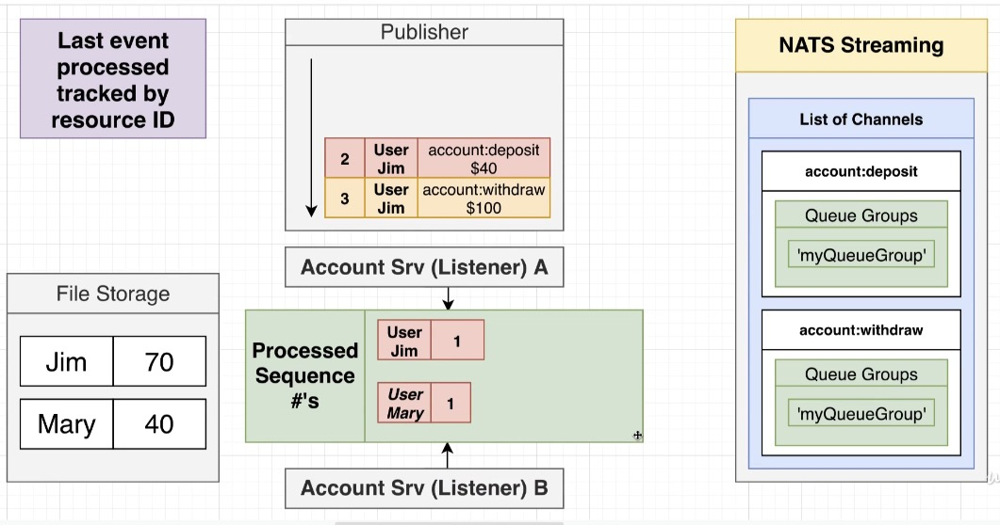

## solution- use seq_id generated by Nats
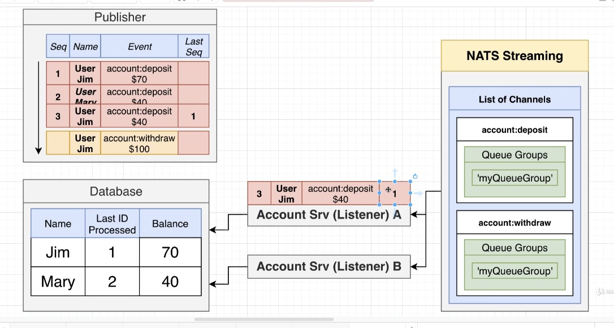
## solution - use continuous version id
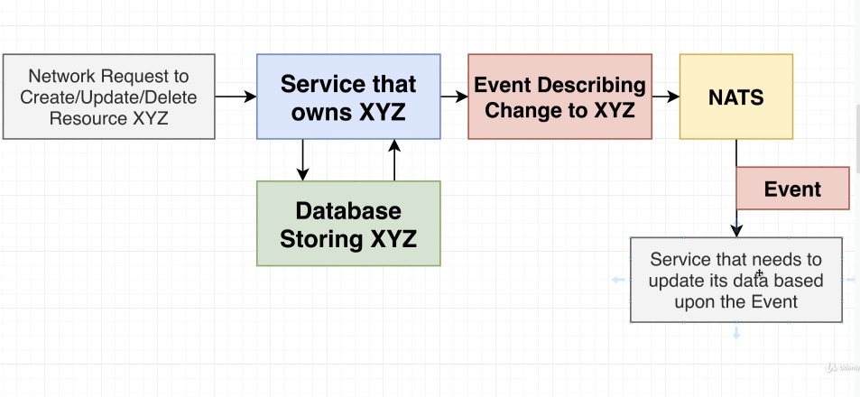
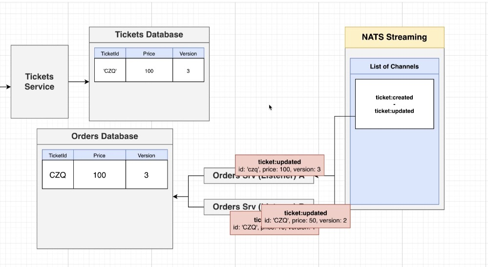


# Order service
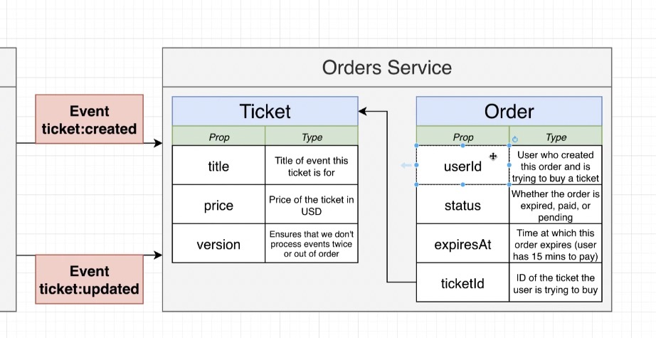
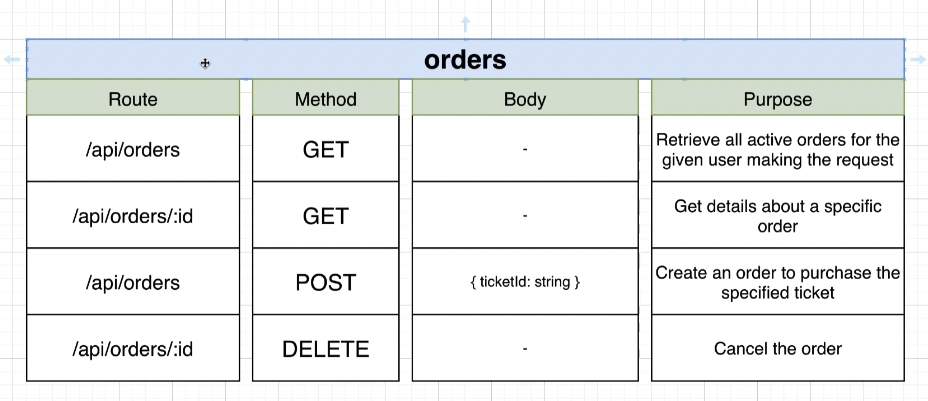

## mongoose for Order and Ticket (ticket <-> order, 1-to-1 Ref)

```typescript
import mongoose from 'mongoose';
import { OrderStatus } from '@yltickets/common';
import { TicketDoc } from './ticket';

export { OrderStatus };

interface OrderAttrs {
    userId: string;
    status: OrderStatus;
    expiresAt: Date;
    ticket: TicketDoc;
}

interface OrderDoc extends mongoose.Document {
    userId: string;
    status: OrderStatus;
    expiresAt: Date;
    ticket: TicketDoc;
}

interface OrderModel extends mongoose.Model<OrderDoc> {
    build(attrs: OrderAttrs): OrderDoc;
}

const orderSchema = new mongoose.Schema(
    {
        userId: {
            type: String,
            required: true,
        },
        status: {
            type: String,
            required: true,
            enum: Object.values(OrderStatus),
            default: OrderStatus.Created,
        },
        expiresAt: {
            type: mongoose.Schema.Types.Date,
        },
        ticket: {
            type: mongoose.Schema.Types.ObjectId,
            ref: 'Ticket',
        },
    },
    {
        toJSON: {
            transform(doc, ret) {
                ret.id = ret._id;
                delete ret._id;
            },
        },
    }
);

orderSchema.statics.build = (attrs: OrderAttrs) => {
    return new Order(attrs);
};

const Order = mongoose.model<OrderDoc, OrderModel>('Order', orderSchema);

export { Order };
```
## mongoose for Ticket
```typescript
import mongoose from 'mongoose';
import { Order, OrderStatus } from './order';

interface TicketAttrs {
  title: string;
  price: number;
}

export interface TicketDoc extends mongoose.Document {
  title: string;
  price: number;
  isReserved(): Promise<boolean>;
}

interface TicketModel extends mongoose.Model<TicketDoc> {
  build(attrs: TicketAttrs): TicketDoc;
}

const ticketSchema = new mongoose.Schema(
  {
    title: {
      type: String,
      required: true,
    },
    price: {
      type: Number,
      required: true,
      min: 0,
    },
  },
  {
    toJSON: {
      transform(doc, ret) {
        ret.id = ret._id;
        delete ret._id;
      },
    },
  }
);

ticketSchema.statics.build = (attrs: TicketAttrs) => {
  return new Ticket(attrs);
};
ticketSchema.methods.isReserved = async function () {
  //NOTE: use keyword `function`: this === the ticket document that we just called 'isReserved' on
  const existingOrder = await Order.findOne({
    ticket: this,
    status: {
      $in: [
        OrderStatus.Created,
        OrderStatus.AwaitingPayment,
        OrderStatus.Complete,
      ],
    },
  });

  return !!existingOrder;
};

const Ticket = mongoose.model<TicketDoc, TicketModel>('Ticket', ticketSchema);

export { Ticket };
```

```typescript
// populate
const order = await Order.findById(req.params.orderId).populate('ticket');

// Gen random mongo ObjectId 
mongoose.Types.ObjectId();

```


## OrderStatus
```typescript
export enum OrderStatus {
  Created = 'created',
  Cancelled = 'cancelled',
  AwaitingPayment = 'awaiting:payment',
  Complete = 'complete',
}
```

# Expiration Service
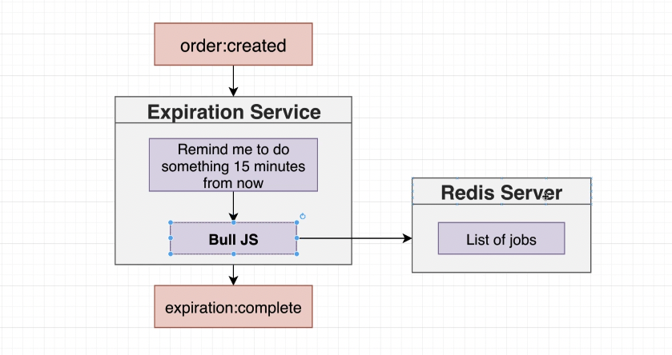
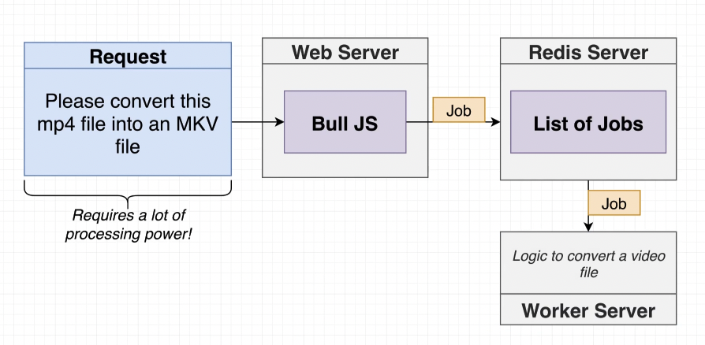
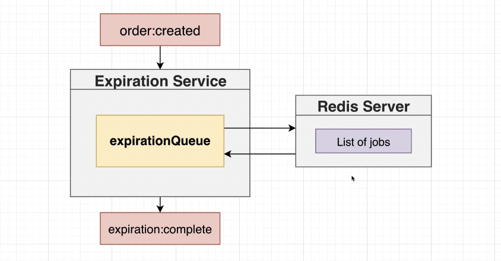

### OrderCreatedListener

```typescript
import {Listener, OrderCreatedEvent, Subjects} from '@yltickets/common';
import {Message} from 'node-nats-streaming';
import {queueGroupName} from './queue-group-name';
import {expirationQueue} from '../../queues/expiration-queue';

export class OrderCreatedListener extends Listener<OrderCreatedEvent> {
    subject: Subjects.OrderCreated = Subjects.OrderCreated;
    queueGroupName = queueGroupName;

    async onMessage(data: OrderCreatedEvent['data'], msg: Message) {
        const delay = new Date(data.expiresAt).getTime() - new Date().getTime();
        console.log('Waiting this many milliseconds to process the job:', delay);

        // push data to redis Queue with delay
        await expirationQueue.add(
            {
                orderId: data.id,
            },
            {
                delay,
            }
        );

        msg.ack();
    }
}

```
### expirationQueue
```typescript
import Queue from 'bull';
import {ExpirationCompletePublisher} from '../events/publishers/expiration-complete-publisher';
import {natsWrapper} from '../nats-wrapper';

// data in Job
interface Payload {
    orderId: string;
}

// create a redis Queue
const expirationQueue = new Queue<Payload>('order:expiration', {
    redis: {
        host: process.env.REDIS_HOST,
    },
});

// Queue process job
expirationQueue.process(async (job) => {
    console.log("expirationQueue job:", job);
    new ExpirationCompletePublisher(natsWrapper.client).publish({
        orderId: job.data.orderId,
    });
});

export {expirationQueue};

```