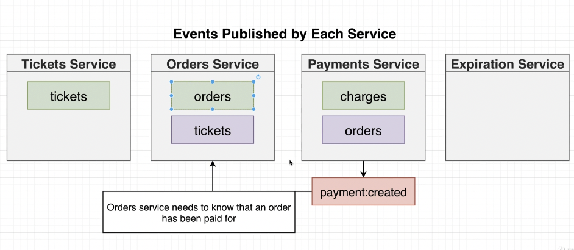

https://ticketing.dev/

`thisisunsafe`

# install ingress-nginx
```
 kubectl apply -f ingress-ngin-controller.yaml

 or 
 
 https://kubernetes.github.io/ingress-nginx/deploy/#docker-for-mac

```

http://ingress-nginx-controller.ingress-nginx.svc.cluster.local


```
sudo visudo

dayong-mac      ALL = (ALL) NOPASSWD: ALL
```

```
sudo vi /etc/hosts

127.0.0.1 ticketing.dev
```


# secret for jwt-secret and stripe-secret
```
 kubectl create secret  generic jwt-secret --from-literal JWT_KEY=mykey123!
 
 // for payments
 private stripe key from 

 https://dashboard.stripe.com/test/dashboard
 
 key=sk_test_xxxxx
 
 kubectl create secret  generic stripe-secret --from-literal STRIPE_KEY=${key}

```


# Auth Service


# Shared Lib

```
 Create an public Organizations: yltickets
 https://www.npmjs.com/settings/yltickets/packages
 
 npm login
 npm publish --access public
 
 // use common 
 npm install @yltickets/common
 // update common to new version
 npm update @yltickets/common
 
```
https://github.com/amliuyong/react-microservices/tree/main/02_ticketing/common


# Tickets Service


# Nats Streaming Server

`kubectl port-forward nats-depl-54fbfb678d-45z4q 4222:4222`

`kubectl port-forward nats-depl-54fbfb678d-45z4q 8222:8222`

http://127.0.0.1:8222/streaming

http://127.0.0.1:8222/streaming/channelsz?subs=1


https://github.com/amliuyong/react-microservices/tree/main/02_ticketing/nats-test/src

### Publish
```javascript
import nats from 'node-nats-streaming';

console.clear();

const stan = nats.connect('ticketing', 'abc', {
  url: 'http://localhost:4222',
});

stan.on('connect', () => {
  console.log('Publisher connected to NATS');

  const data = JSON.stringify({
    id: '123',
    title: 'concert',
    price: 20,
  });

  stan.publish('ticket:created', data, () => {
    console.log('Event published');
  });
});

```

### Listener

```javascript
import nats, {Message} from 'node-nats-streaming';
import {randomBytes} from 'crypto';

console.clear();

const clientId = randomBytes(8).toString('hex');
console.log(`clientId: ${clientId}`)
const stan = nats.connect('ticketing', clientId, {
    url: 'http://localhost:4222',
});

stan.on('connect', () => {
    console.log('Listener connected to NATS');

    stan.on('close', () => {
        console.log('NATS connection closed!');
        process.exit();
    });

    const options = stan
        .subscriptionOptions()
        .setManualAckMode(true)
        .setAckWait(20000)
        .setDeliverAllAvailable()
        .setDurableName('accounting-service');

    const subscription = stan.subscribe(
        'ticket:created',
        'queue-group-name',
        options
    );

    subscription.on('message', (msg: Message) => {
        const data = msg.getData();
        if (typeof data === 'string') {
            console.log(`Received event #${msg.getSequence()}, with data: ${data}`);
        }
        msg.ack();
    });
});

process.on('SIGINT', () => stan.close());
process.on('SIGTERM', () => stan.close());

```

# Events


# How to handle disorder event

## Last event processed tracked by resource ID


## solution- use seq_id generated by Nats

## solution - use continuous version id


# Order service


## mongoose for Order and Ticket (ticket <-> order, 1-to-1 Ref)

```typescript
import mongoose from 'mongoose';
import { OrderStatus } from '@yltickets/common';
import { TicketDoc } from './ticket';

export { OrderStatus };

interface OrderAttrs {
    userId: string;
    status: OrderStatus;
    expiresAt: Date;
    ticket: TicketDoc;
}

interface OrderDoc extends mongoose.Document {
    userId: string;
    status: OrderStatus;
    expiresAt: Date;
    ticket: TicketDoc;
}

interface OrderModel extends mongoose.Model<OrderDoc> {
    build(attrs: OrderAttrs): OrderDoc;
}

const orderSchema = new mongoose.Schema(
    {
        userId: {
            type: String,
            required: true,
        },
        status: {
            type: String,
            required: true,
            enum: Object.values(OrderStatus),
            default: OrderStatus.Created,
        },
        expiresAt: {
            type: mongoose.Schema.Types.Date,
        },
        ticket: {
            type: mongoose.Schema.Types.ObjectId,
            ref: 'Ticket',
        },
    },
    {
        toJSON: {
            transform(doc, ret) {
                ret.id = ret._id;
                delete ret._id;
            },
        },
    }
);

orderSchema.statics.build = (attrs: OrderAttrs) => {
    return new Order(attrs);
};

const Order = mongoose.model<OrderDoc, OrderModel>('Order', orderSchema);

export { Order };
```
## mongoose for Ticket
```typescript
import mongoose from 'mongoose';
import { Order, OrderStatus } from './order';

interface TicketAttrs {
  title: string;
  price: number;
}

export interface TicketDoc extends mongoose.Document {
  title: string;
  price: number;
  isReserved(): Promise<boolean>;
}

interface TicketModel extends mongoose.Model<TicketDoc> {
  build(attrs: TicketAttrs): TicketDoc;
}

const ticketSchema = new mongoose.Schema(
  {
    title: {
      type: String,
      required: true,
    },
    price: {
      type: Number,
      required: true,
      min: 0,
    },
  },
  {
    toJSON: {
      transform(doc, ret) {
        ret.id = ret._id;
        delete ret._id;
      },
    },
  }
);

ticketSchema.statics.build = (attrs: TicketAttrs) => {
  return new Ticket(attrs);
};
ticketSchema.methods.isReserved = async function () {
  //NOTE: use keyword `function`: this === the ticket document that we just called 'isReserved' on
  const existingOrder = await Order.findOne({
    ticket: this,
    status: {
      $in: [
        OrderStatus.Created,
        OrderStatus.AwaitingPayment,
        OrderStatus.Complete,
      ],
    },
  });

  return !!existingOrder;
};

const Ticket = mongoose.model<TicketDoc, TicketModel>('Ticket', ticketSchema);

export { Ticket };
```

```typescript
// populate
const order = await Order.findById(req.params.orderId).populate('ticket');

// Gen random mongo ObjectId 
mongoose.Types.ObjectId();

```


## OrderStatus
```typescript
export enum OrderStatus {
  Created = 'created',
  Cancelled = 'cancelled',
  AwaitingPayment = 'awaiting:payment',
  Complete = 'complete',
}
```

# Expiration Service


### OrderCreatedListener

```typescript
import {Listener, OrderCreatedEvent, Subjects} from '@yltickets/common';
import {Message} from 'node-nats-streaming';
import {queueGroupName} from './queue-group-name';
import {expirationQueue} from '../../queues/expiration-queue';

export class OrderCreatedListener extends Listener<OrderCreatedEvent> {
    subject: Subjects.OrderCreated = Subjects.OrderCreated;
    queueGroupName = queueGroupName;

    async onMessage(data: OrderCreatedEvent['data'], msg: Message) {
        const delay = new Date(data.expiresAt).getTime() - new Date().getTime();
        console.log('Waiting this many milliseconds to process the job:', delay);

        // push data to redis Queue with delay
        await expirationQueue.add(
            {
                orderId: data.id,
            },
            {
                delay,
            }
        );

        msg.ack();
    }
}

```
### expirationQueue
```typescript
import Queue from 'bull';
import {ExpirationCompletePublisher} from '../events/publishers/expiration-complete-publisher';
import {natsWrapper} from '../nats-wrapper';

// data in Job
interface Payload {
    orderId: string;
}

// create a redis Queue
const expirationQueue = new Queue<Payload>('order:expiration', {
    redis: {
        host: process.env.REDIS_HOST,
    },
});

// Queue process job
expirationQueue.process(async (job) => {
    console.log("expirationQueue job:", job);
    new ExpirationCompletePublisher(natsWrapper.client).publish({
        orderId: job.data.orderId,
    });
});

export {expirationQueue};

```

# Payment




# Client


## hooks - useRequest
```javascript

import axios from 'axios';
import {useState} from 'react';

export default ({url, method, body, onSuccess}) => {
    const [errors, setErrors] = useState(null);

    const doRequest = async (props = {}) => {
        try {
            setErrors(null);
            const response = await axios[method](url,
                {...body, ...props}
            );

            if (onSuccess) {
                onSuccess(response.data);
            }

            return response.data;
        } catch (err) {
            setErrors(
                <div className="alert alert-danger">
                    <h4>Ooops....</h4>
                    <ul className="my-0">
                        {err.response.data.errors.map(err => (
                            <li key={err.message}>{err.message}</li>
                        ))}
                    </ul>
                </div>
            );
        }
    };

    return {doRequest, errors};
};

```
## Component - TicketShow
```javascript
import useRequest from '../../hooks/use-request';
import Router from "next/router";


const TicketShow = ({ticket}) => {
    const {doRequest, errors} = useRequest({
        url: '/api/orders',
        method: 'post',
        body: {
            ticketId: ticket.id
        },
        onSuccess: (order) => {
            console.log("order:", order);
            Router.push('/orders/[orderId]', `/orders/${order.id}`)
        }
    });

    return (
        <div>
            <h1>{ticket.title}</h1>
            <h4>Price: {ticket.price}</h4>
            {errors}
            <button onClick={(event) => doRequest()} className="btn btn-primary">Purchase</button>
        </div>
    )
};

TicketShow.getInitialProps = async (context, client, currentUser) => {
    const {ticketId} = context.query;
    const {data} = await client.get(`/api/tickets/${ticketId}`)
    return {ticket: data};
}

export default TicketShow;
```
## Header
```javascript
import Link from 'next/link';

export default ({currentUser}) => {
    const links = [
        !currentUser && {label: 'Sign Up', href: '/auth/signup'},
        !currentUser && {label: 'Sign In', href: '/auth/signin'},
        currentUser && {label: 'Sell Ticket', href: '/tickets/new'},
        currentUser && {label: 'My Orders', href: '/orders'},
        currentUser && {label: 'Sign Out', href: '/auth/signout'}
    ]
        .filter(linkConfig => linkConfig)
        .map(({label, href}) => {
            return (
                <li key={href} className="nav-item">
                    <Link href={href}>
                        <a className="nav-link">{label}</a>
                    </Link>
                </li>
            );
        });

    return (
        <nav className="navbar navbar-light bg-light">
            <Link href="/">
                <a className="navbar-brand">GitTix</a>
            </Link>

            <div className="d-flex justify-content-end">
                <ul className="nav d-flex align-items-center">{links}</ul>
            </div>
        </nav>
    );
};

```

# CICD 
```
kubectl config use-context docker-desktop

```


## Deploy to Digital Ocean  

https://github.com/amliuyong/ticketing/blob/master/.github/workflows/deploy-auth.yaml

```yaml
name: deploy-auth

on:
  push:
    branches: 
      - master
    paths:
      - 'auth/**'

jobs:
  build:
    runs-on: ubuntu-latest
    steps:
      - uses: actions/checkout@v2
      - run: cd auth && docker build -t stephengrider/auth .
      - run: docker login -u $DOCKER_USERNAME -p $DOCKER_PASSWORD
        env:
          DOCKER_USERNAME: ${{ secrets.DOCKER_USERNAME }}
          DOCKER_PASSWORD: ${{ secrets.DOCKER_PASSWORD }}
      - run: docker push stephengrider/auth
      - uses: digitalocean/action-doctl@v2
        with:
          token: ${{ secrets.DIGITALOCEAN_ACCESS_TOKEN }}
      - run: doctl kubernetes cluster kubeconfig save ticketing
      - run: kubectl rollout restart deployment auth-depl

```
### ingress
```yaml
apiVersion: extensions/v1beta1
kind: Ingress
metadata:
  name: ingress-service
  annotations:
    kubernetes.io/ingress.class: nginx
    nginx.ingress.kubernetes.io/use-regex: 'true'
spec:
  rules:
    - host: www.ticketing-app-prod.xyz
      http:
        paths:
          - path: /api/payments/?(.*)
            backend:
              serviceName: payments-srv
              servicePort: 3000
          - path: /api/users/?(.*)
            backend:
              serviceName: auth-srv
              servicePort: 3000
          - path: /api/tickets/?(.*)
            backend:
              serviceName: tickets-srv
              servicePort: 3000
          - path: /api/orders/?(.*)
            backend:
              serviceName: orders-srv
              servicePort: 3000
          - path: /?(.*)
            backend:
              serviceName: client-srv
              servicePort: 3000
---
apiVersion: v1
kind: Service
metadata:
  annotations:
    service.beta.kubernetes.io/do-loadbalancer-enable-proxy-protocol: 'true'
    service.beta.kubernetes.io/do-loadbalancer-hostname: 'www.ticketing-app-prod.xyz'
  labels:
    helm.sh/chart: ingress-nginx-2.0.3
    app.kubernetes.io/name: ingress-nginx
    app.kubernetes.io/instance: ingress-nginx
    app.kubernetes.io/version: 0.32.0
    app.kubernetes.io/managed-by: Helm
    app.kubernetes.io/component: controller
  name: ingress-nginx-controller
  namespace: ingress-nginx
spec:
  type: LoadBalancer
  externalTrafficPolicy: Local
  ports:
    - name: http
      port: 80
      protocol: TCP
      targetPort: http
    - name: https
      port: 443
      protocol: TCP
      targetPort: https
  selector:
    app.kubernetes.io/name: ingress-nginx
    app.kubernetes.io/instance: ingress-nginx
    app.kubernetes.io/component: controller
```